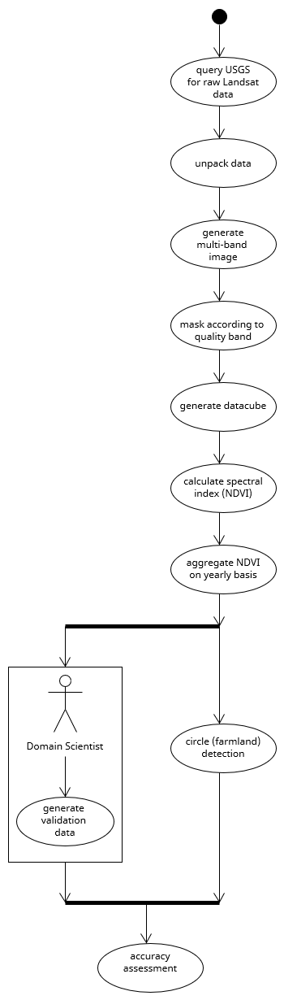

# Requirements

This document lists all functional, non-functional and possibly other forms of requirements for this project.

## Functional Requirements

## Non-functional Requirements

- *honestly, no clue what to write here*

## Other Requirements

### User Requirements

- user must be allowed to set a date range for which to download satellite products; the user must be informed if the endpoints are inclusive or exclusive
- user must be allowed to set an AOI (Area of Interest) for which to download satellite imagery. The workflow config may allow multiple types of coordinate inputs or enforce a specific type
- user may be allowed to choose a processing level (i.e. data quality level) for images to download
- user must be able to specify temporal aggregation steps either in pre-defined *scales*, e.g. yearly, quarterly, or by setting specific date ranges themselves; the user must be informed whether or not the endpoints are inclusive or exclusive
- user should be able to choose from a couple of vegetation/soil indices
- user may be allowed to set a error handling strategy on their own (e.g. retry, fail, ignore)

### System Requirements

- the workflow must handle processing errors gracefully and according to user specification
- the workflow must handle API errors gracefully and potentially try to re-execution of download requests
- the worklow should be able to run mostly independent of host operating system
    - depends on whether or not snakemake allows containerized execution or not!

